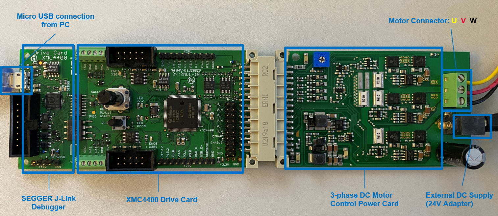
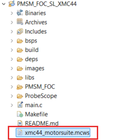
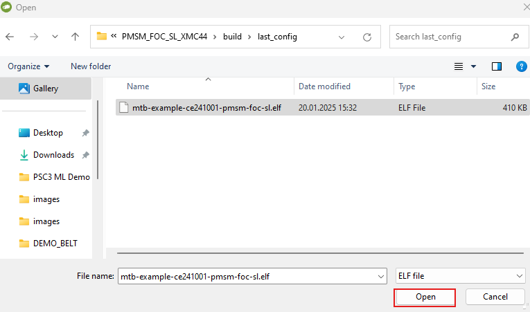
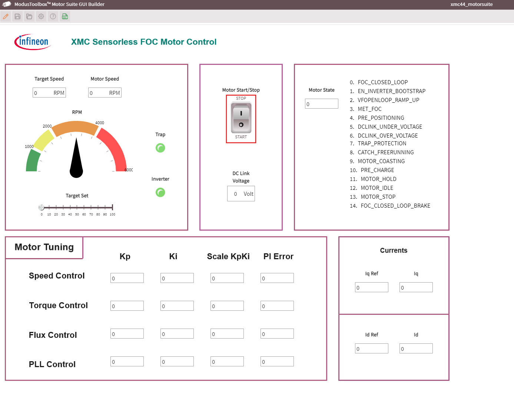
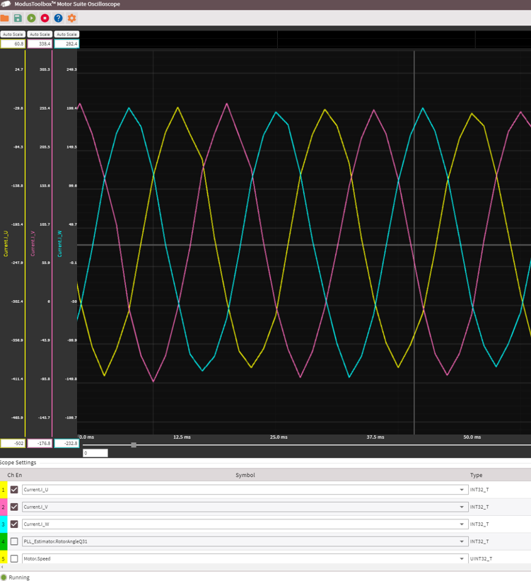
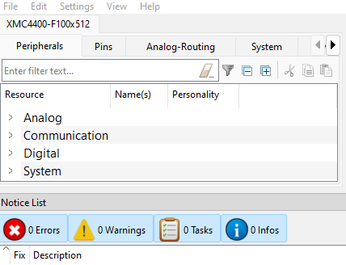

# PMSM FOC SL XMC4400 Drive Card

This code example (CE) demonstrates the sensorless (SL) permanent magnet synchronous motor (PMSM) field-oriented control (FOC) motor control application from Infineon XMC&trade; MCU using XMC4400 Drive Card. To test this code example; [XMC4400 Drive Card](https://www.infineon.com/cms/en/product/evaluation-boards/kit_xmc4400_dc_v1/), [3-phase DC power board](https://www.infineon.com/cms/en/product/evaluation-boards/kit_motor_dc_250w_24v/), and Nanotec DC motor (DB42S03) are required.


## Requirements

- [ModusToolbox&trade;](https://www.infineon.com/modustoolbox) v3.3 or later (tested with v3.3)
- [SEGGER J-Link](https://www.segger.com/downloads/jlink/#J-LinkSoftwareAndDocumentationPack) v7.90a software
- [ModusToolbox&trade; Motor Suite](https://softwaretools.infineon.com/tools/com.ifx.tb.tool.ifxmotorsolutions)
- Programming language: C
- Associated parts: [XMC4400 MCU](https://www.infineon.com/cms/en/product/microcontroller/32-bit-industrial-microcontroller-based-on-arm-cortex-m/32-bit-xmc4000-industrial-microcontroller-arm-cortex-m4/xmc4400/)


## Supported toolchains (make variable 'TOOLCHAIN')

- GNU Arm&reg; Embedded Compiler v11.3 (`GCC_ARM`) – Default value of `TOOLCHAIN`


## Supported kits (make variable 'TARGET')

- [XMC4400 Drive Card](https://www.infineon.com/cms/en/product/evaluation-boards/kit_xmc4400_dc_v1/) (`KIT_XMC4400_DC_V1`) – Default value of `TARGET`


## Hardware setup

Before using this code example, ensure that the XMC4400 Drive Card is correctly connected to the 3-phase DC power card. Also, connect the Nanotec motor to the power card as in **Figure 1**. See the [3-phase Motor Control Power Card user manual](https://www.infineon.com/dgdl/Infineon-AN_250W_DriveCard-UM-v01_00-EN.pdf?fileId=5546d462696dbf120169a10447b76f33) for more details.

**Figure 1. Hardware setup with XMC44 Drive Card, power board, and Nanotec motor**




## Software setup

This code example uses Infineon's [ModusToolbox&trade; Motor Suite](https://softwaretools.infineon.com/tools/com.ifx.tb.tool.ifxmotorsolutions) application by default to run and control the motor.

> **Note:** If you want to run the motor without using ModusToolbox&trade; Motor Suite, change the `motor_request_start` flag to **true** inside the *main.c* file. As it will directly start the motor after programming the board.


## Using the code example


### Create the project

The ModusToolbox&trade; tools package provides the Project Creator as both a GUI tool and a command line tool.

<details><summary><b>Use Project Creator GUI</b></summary>

1. Open the Project Creator GUI tool.

   There are several ways to do this, including launching it from the dashboard or from inside the Eclipse IDE. For more details, see the [Project Creator user guide](https://www.infineon.com/ModusToolboxProjectCreator) (locally available at *{ModusToolbox&trade; install directory}/tools_{version}/project-creator/docs/project-creator.pdf*).

2. On the **Choose Board Support Package (BSP)** page, select a kit supported by this code example. See [Supported kits](#supported-kits-make-variable-target).

   > **Note:** To use this code example for a kit not listed here, you may need to update the source files. If the kit does not have the required resources, the application may not work.

3. On the **Select Application** page:

   a. Select the **Applications(s) Root Path** and the **Target IDE**.

   > **Note:** Depending on how you open the Project Creator tool, these fields may be pre-selected for you.

   b. Select this code example from the list by enabling its check box.

   > **Note:** You can narrow the list of displayed examples by typing in the filter box.

   c. (Optional) Change the suggested **New Application Name** and **New BSP Name**.

   d. Click **Create** to complete the application creation process.

</details>


<details><summary><b>Use Project Creator CLI</b></summary>

The 'project-creator-cli' tool can be used to create applications from a CLI terminal or from within batch files or shell scripts. This tool is available in the *{ModusToolbox&trade; install directory}/tools_{version}/project-creator/* directory.

Use a CLI terminal to invoke the 'project-creator-cli' tool. On Windows, use the command-line 'modus-shell' program provided in the ModusToolbox&trade; installation instead of a standard Windows command-line application. This shell provides access to all ModusToolbox&trade; tools. You can access it by typing "modus-shell" in the search box in the Windows menu. In Linux and macOS, you can use any terminal application.

The following example clones the "[mtb-example-ce241001-pmsm-foc-sl](https://github.com/Infineon/mtb-example-ce241001-pmsm-foc-sl)" application with the desired name "PMSM_FOC_SL_XMC44" configured for the *KIT_XMC4400_DC_V1* BSP into the specified working directory, *C:/mtb_projects*:

   ```
   project-creator-cli --board-id KIT_XMC4400_DC_V1 --app-id mtb-example-ce241001-pmsm-foc-sl --user-app-name PMSM_FOC_SL_XMC44 --target-dir "C:/mtb_projects"
   ```

The 'project-creator-cli' tool has the following arguments:

Argument | Description | Required/optional
---------|-------------|-----------
`--board-id` | Defined in the <id> field of the [BSP](https://github.com/Infineon?q=bsp-manifest&type=&language=&sort=) manifest | Required
`--app-id`   | Defined in the <id> field of the [CE](https://github.com/Infineon?q=ce-manifest&type=&language=&sort=) manifest | Required
`--target-dir`| Specify the directory in which the application is to be created if you prefer not to use the default current working directory | Optional
`--user-app-name`| Specify the name of the application if you prefer to have a name other than the example's default name | Optional

<br>

> **Note:** The project-creator-cli tool uses the `git clone` and `make getlibs` commands to fetch the repository and import the required libraries. For details, see the "Project creator tools" section of the [ModusToolbox&trade; tools package user guide](https://www.infineon.com/ModusToolboxUserGuide) (locally available at {ModusToolbox&trade; install directory}/docs_{version}/mtb_user_guide.pdf).

</details>


### Open the project

After the project has been created, you can open it in your preferred development environment.


<details><summary><b>Eclipse IDE</b></summary>

If you opened the Project Creator tool from the included Eclipse IDE, the project will open in Eclipse automatically.

For more details, see the [Eclipse IDE for ModusToolbox&trade; user guide](https://www.infineon.com/MTBEclipseIDEUserGuide) (locally available at *{ModusToolbox&trade; install directory}/docs_{version}/mt_ide_user_guide.pdf*).

</details>


<details><summary><b>Visual Studio (VS) Code</b></summary>

Launch VS Code manually, and then open the generated *{project-name}.code-workspace* file located in the project directory.

For more details, see the [Visual Studio Code for ModusToolbox&trade; user guide](https://www.infineon.com/MTBVSCodeUserGuide) (locally available at *{ModusToolbox&trade; install directory}/docs_{version}/mt_vscode_user_guide.pdf*).

</details>

<details><summary><b>Command line</b></summary>

If you prefer to use the CLI, open the appropriate terminal, and navigate to the project directory. On Windows, use the command-line 'modus-shell' program; on Linux and macOS, you can use any terminal application. From there, you can run various `make` commands.

For more details, see the [ModusToolbox&trade; tools package user guide](https://www.infineon.com/ModusToolboxUserGuide) (locally available at *{ModusToolbox&trade; install directory}/docs_{version}/mtb_user_guide.pdf*).

</details>


## Operation

1. Connect the XMC4400 Drive Card to the PC with a USB connector. 

2. To flash the code to the board, click **Generate Launches for <Application Name>** in **Quick Panel**.

3. Program the board using one of the following:

   <details><summary><b>Using Eclipse IDE</b></summary>

      1. Select the application project in the Project Explorer.

      2. In the **Quick Panel**, scroll down, and click **\<Application Name> Program (JLink)**.
   </details>


   <details><summary><b>In other IDEs</b></summary>

   Follow the instructions in your preferred IDE.
   </details>


   <details><summary><b>Using CLI</b></summary>

      From the terminal, execute the `make program` command to build and program the application using the default toolchain to the default target. The default toolchain is specified in the application's Makefile but you can override this value manually:
      ```
      make program TOOLCHAIN=<toolchain>
      ```

      Example:
      ```
      make program TOOLCHAIN=GCC_ARM
      ```
   </details>

4. Close if ModusToolbox&trade; Motor Suite is opened already. In the ModusToolbox&trade; Project window, click the *xmc44_motorsuite.mcws* file and open it to access the ModusToolbox&trade; Motor Suite.

   **Figure 2. Opening the ModusToolbox&trade; Motor Suite file**

   

5. Navigate to the project build path (*C:\<Users\Username>\PMSM_FOC_SL_XMC44\build\last_config*) and open your project *elf* file as shown in **Figure 3**.

   **Figure 3. Opening the project elf file**

   

6. For optimum ModusToolbox&trade; Motor Suite view, adjust it in full screen mode. To run the motor, click the **Motor Start/Stop** switch in the GUI as shown in **Figure 4**. Observe that the motor should start and automatically go to FOC closed loop mode in 1000 RPM by default. You can also adjust the motor speed by adding a value to the **Target Speed**, or changing the speed via the **Target Set** slide. You can also observe and adjust the motor control parameters from the **Motor Tuning** table.

   **Figure 4. Motor Suite GUI start**

   

7. Additionally, there is an option to view the FOC variables from the GUI using the Oscilloscope option. Click **Oscilloscope** on the upper right corner of the GUI to launch it. In the Oscilloscope window, you can select the **Auto Scale** option for the selected parameters to view. Also from the bottom side of the window in **Scope Settings**, you can select the parameter that you want to observe in real time as shown in **Figure 5**.

   **Figure 5. FOC parameters in Oscilloscope tab**

   


## Debugging

You can debug the example to step through the code.


<details><summary><b>In Eclipse IDE</b></summary>

Use the **\<Application Name> Debug (Jlink)** configuration in the **Quick Panel**. For details, see the "Program and debug" section in the [Eclipse IDE for ModusToolbox&trade; user guide](https://www.infineon.com/MTBEclipseIDEUserGuide).


</details>


<details><summary><b>In other IDEs</b></summary>

Follow the instructions in your preferred IDE.

</details>


## Design and implementation

This code example executes an FOC algorithm with a Nanotec motor using XMC4400 Drive Card. Observe the motor control parameters and tune using Infineon's Motor Suite as explained in [Operation](#operation) section. The default control mode of the software is configured as "Speed Controlled Direct FOC", but it can be changed accordingly in the user config file by changing the `MY_FOC_CONTROL_SCHEME` macro. See the [PMSM FOC motor control using XMC&trade; MCUs](https://www.infineon.com/dgdl/Infineon-AP32370_PMSM_FOC_for_XMC1000_4000-ApplicationNotes-v01_07-EN.zip?fileId=5546d4626bb628d7016be66999aa7d4f) application note for more details.


### Resources and settings

This code does not use the Device Configurator in ModusToolbox&trade;. All peripheral definitions and initializations are directly integrated within the software using low-level drivers by calling the necessary libraries. When you want to change a configuration variable or parameter, do within the code in the user config header files rather than in the Device Configurator.

**Figure 6. Device Configurator in ModusToolbox&trade;**



For more details, see the [Eclipse IDE for ModusToolbox&trade; software user guide](https://www.infineon.com/MTBEclipseIDEUserGuide).


## Related resources

Resources | Links
--------------------|----------------------
Application notes | [AP32370](https://www.infineon.com/dgdl/Infineon-AP32370_PMSM_FOC_for_XMC1000_4000-ApplicationNotes-v01_07-EN.zip?fileId=5546d4626bb628d7016be66999aa7d4f) – PMSM FOC motor control using XMC&trade; MCUs
Kit guide| [XMC4400 Drive Card](https://www.infineon.com/dgdl/Board_Users_Manual_DriveCard_XMC4400_R1%200.pdf?fileId=db3a3043427ac3e201427f46ec9b2626) – KIT_XMC4400_DC_V1 board user's manual
Code examples  | [Using ModusToolbox&trade;](https://github.com/Infineon/Code-Examples-for-ModusToolbox-Software) on GitHub
Device documentation | [XMC4400 family datasheet](https://www.infineon.com/dgdl/Infineon-XMC4400-DS-v01_03-EN.pdf?fileId=5546d462696dbf12016981795855391d)
Development kits | Select your kits from the [Evaluation board finder](https://www.infineon.com/cms/en/design-support/finder-selection-tools/product-finder/evaluation-board).
Libraries on GitHub  | [mtb-xmclib-cat3](https://github.com/Infineon/mtb-xmclib-cat3) – XMC&trade; Peripheral Driver Library (XMCLib) and docs 
Tools  | [ModusToolbox&trade;](https://www.infineon.com/modustoolbox) – ModusToolbox&trade; software is a collection of easy-to-use libraries and tools enabling rapid development with Infineon MCUs for applications ranging from wireless and cloud-connected systems, edge AI/ML, embedded sense and control, to wired USB connectivity using PSOC&trade; Industrial/IoT MCUs, AIROC&trade; Wi-Fi and Bluetooth&reg; connectivity devices, XMC&trade; Industrial MCUs, and EZ-USB&trade;/EZ-PD&trade; wired connectivity controllers. ModusToolbox&trade; incorporates a comprehensive set of BSPs, HAL, libraries, configuration tools, and provides support for industry-standard IDEs to fast-track your embedded application development.

<br>


## Other resources

Infineon provides a wealth of data at [www.infineon.com](https://www.infineon.com) to help you select the right device, and quickly and effectively integrate it into your design.

For XMC&trade; MCU devices, see [32-bit XMC&trade; industrial microcontroller based on Arm&reg; Cortex&reg;-M](https://www.infineon.com/cms/en/product/microcontroller/32-bit-industrial-microcontroller-based-on-arm-cortex-m/).

## Document history

Document title: *CE241001* – *PMSM FOC SL XMC4400 Drive Card*

 Version | Description of change
 ------- | ---------------------
 1.0.0   | New code example
<br>
------

All other trademarks or registered trademarks referenced herein are the property of their respective owners.

The Bluetooth&reg; word mark and logos are registered trademarks owned by Bluetooth SIG, Inc., and any use of such marks by Infineon is under license.

PSOC&trade;, formerly known as PSoC&trade;, is a trademark of Infineon Technologies. Any references to PSoC&trade; in this document or others shall be deemed to refer to PSOC&trade;.


© 2025 Infineon Technologies AG

All Rights Reserved.

### Legal disclaimer

The information given in this document shall in no event be regarded as a guarantee of conditions or characteristics. With respect to any examples or hints given herein, any typical values stated herein and/or any information regarding the application of the device, Infineon Technologies hereby disclaims any and all warranties and liabilities of any kind, including without limitation, warranties of non-infringement of intellectual property rights of any third party.

### Information

For further information on technology, delivery terms and conditions and prices, please contact the nearest Infineon Technologies Office (www.infineon.com).

### Warnings

Due to technical requirements, components may contain dangerous substances. For information on the types in question, please contact the nearest Infineon Technologies Office.

Infineon Technologies components may be used in life-support devices or systems only with the express written approval of Infineon Technologies, if a failure of such components can reasonably be expected to cause the failure of that life-support device or system or to affect the safety or effectiveness of that device or system. Life support devices or systems are intended to be implanted in the human body or to support and/or maintain and sustain and/or protect human life. If they fail, it is reasonable to assume that the health of the user or other persons may be endangered.

-------------------------------------------------------------------------------
